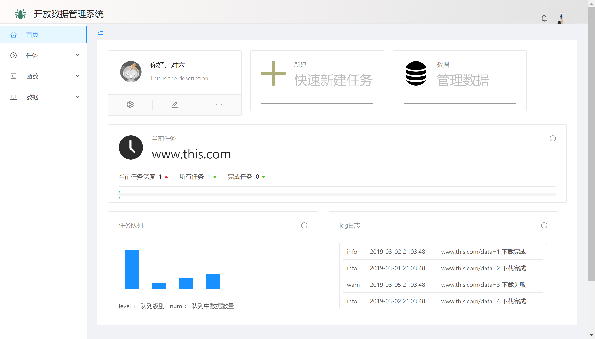
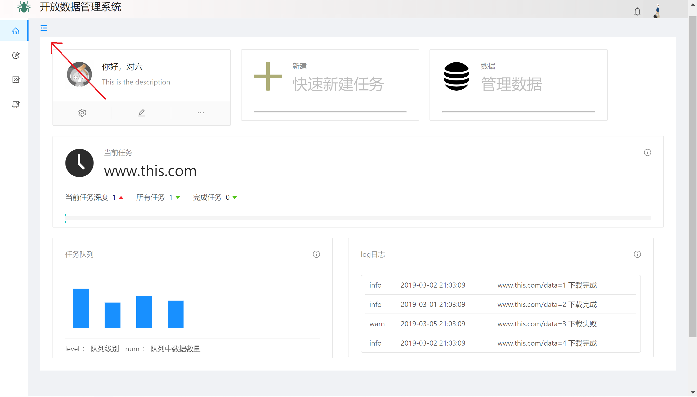
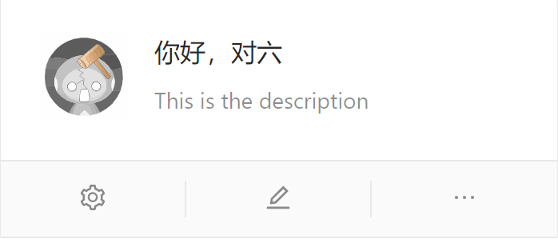
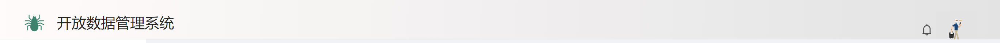
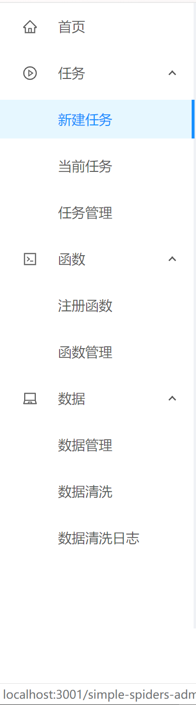

## 首页

> 首页视觉&交互设计稿

- [x] 主页dashboard
  - [ ] dashboard上各个标签点击交互
  - [ ] 个人信息设置，点击个人信息看板下方 个人信息设置按钮 后弹出modal窗口，可更新设置
  - [ ] 系统信息设置，modal框
- [ ] 页头 ~~感觉页头需要重新设计~~
- [x] 侧边导航栏
- [x] 页脚

首页设计为对其他模块的导航，主要对常用的个人信息、采集任务建立、数据管理、清洗日志进行图表化导航

另外还有当前任务可以清晰直观的看到正在执行的数据采集任务(一般来说只有选择较多的数据时才会耗时较长)

如图：

对于侧边栏可点击进行隐藏

其中个人信息看板下方的两个按钮分别表示系统信息设计与个人信息设置，点击则会调转相应的设置页面

- 系统设置主要是系统主题更改以及语言
- 个人设置为个人信息的更改

## 页头

## 侧边栏导航

- [ ] ~~侧边栏需更新~~
  - [ ] ~~数据目录下去掉数据清洗~~

## 页脚

