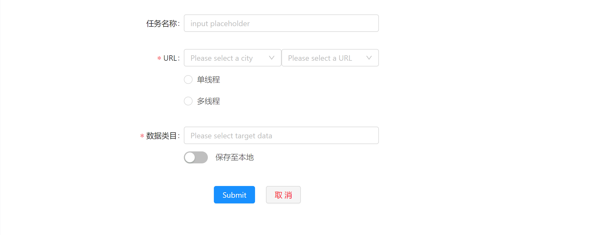
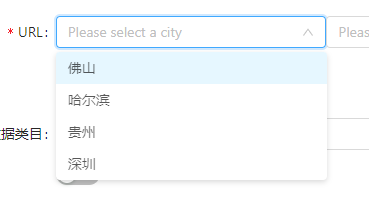
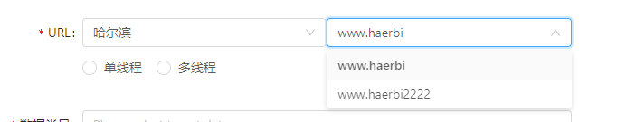
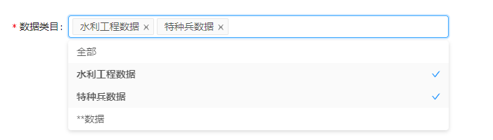
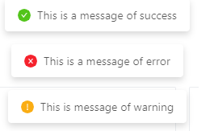
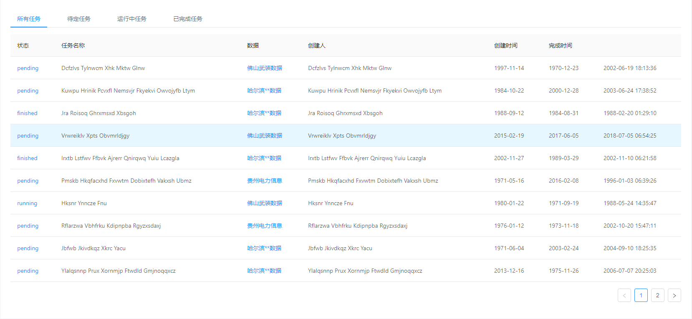
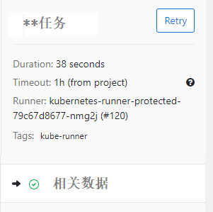

> 任务管理页面设计

对于任务整体分为两种类型的任务，数据采集任务与数据清洗任务

- [ ] 新建任务
  - [ ] 采集任务与清洗任务标签
  - [x] 新建采集任务页面
  - [ ] 新建清洗任务页面 
  - [ ] 任务建立成功之后message反馈
- [ ] 当前任务
  - [ ] 进度条
  - [ ] 实时控制台消息打印
- [ ] 任务管理
  - [x] 任务管理初始页面
  - [ ] 任务管理页面中其他标签页的点击交互
  - [ ] 点击任务之后跳转任务详情页面，与当前任务页面类似，不过增加侧边信息(重新尝试任务button:retry\任务运行时长\任务相关数据)，同一架构 
  - [ ] 任务详情页交互，点击retry重新发起任务；点击相关数据可以进入数据页面

## 新建任务

新建任务则需要支持两种类型任务的新建：**采集任务**或是**清洗任务**

两种任务新建面板以不同标签页的形式进行切换，默认展示新建采集任务

 

其中采集任务主要需要选择城市以及数据类目来确定采集的数据，可选的功能有多数据采集、单线程\多线程采集、保存数据至本地;任务名称用来标识任务，可选择默认值即采集数据名称

对于不同的城市数据，需要建立多个采集任务进行采集；而同一网站下的不同数据可以以多选的方式进行采集

而清洗任务同样需要选择数据进行清洗，不同的是，数据是已采集好的，不支持多线程清洗，可选功能为保留原始数据(默认保留部分原始数据--原始数据中的脏数据保留10条)

对于数据的选择同样是下拉列表依次选择城市、数据名称，数据可多选

新建采集任务页面中，需要用户选择或填写字段：

- 任务名称  

  任务名称是非必填项，默认选择数据名称作为任务名

- URL
  
  URL选择提供两个输入框，城市与URL，其中城市输入框是下拉列表，提供以支持的城市选择，选择好城市之后自然会填充URL

  

  因为有的城市可能有两个数据网站，所以当只有一个数据网站时，选择城市后默认填充URL，否则需要手动选择

  

- 单线程/多线程
  
  默认选择单线程，当选择多线程后会出现一个输入框，可填写线程数

  

- 数据类目
  
  当前城市下的所有数据类目会在下拉列表中罗列出来，可进行多选

  

当任务提交成功或者失败时，会有message信息进行反馈

## 当前任务

当前任务页面需要展示当前任务 进行过程中的**实时信息**的展示

需要展示的实时信息包括：
- 当前任务进度 通过进度条进行反馈
    
- 当前任务实时日志 通过类似CMD的控制台面板进行打印实时日志，可以清洗的看到任务的进行以及错误的反馈
    

同样两种任务通过标签页区分，默认展示正在进行的任务类型页面，若同时进行着采集任务与清洗任务，则默认展示采集任务

## 任务管理

任务管理是对所有的任务的管理，按照任务状态建立标签，对不同状态的任务进行管理，对于任务点击后会进入任务详情页面

任务详情

对于任务详情的侧边类似以下设计

- [ ] restart按钮设计