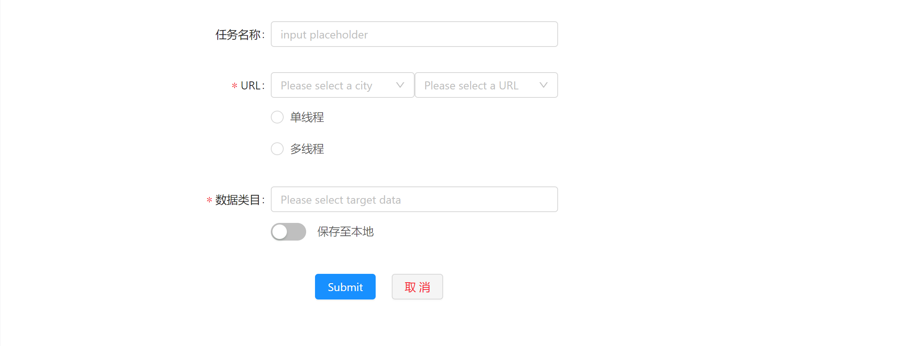
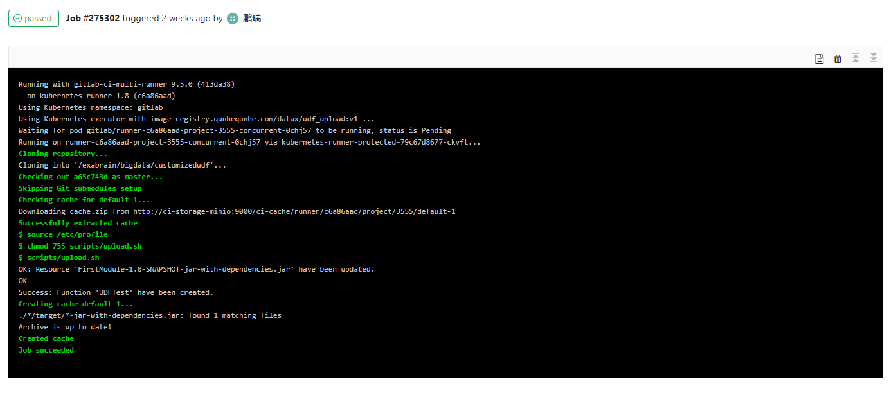
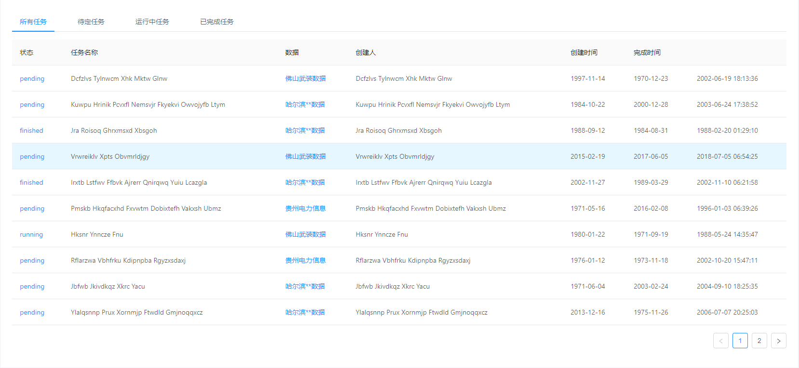

> 任务管理页面设计

对于任务整体分为两种类型的任务，数据采集任务与数据清洗任务

## 新建任务

新建任务则需要支持两种类型任务的新建：**采集任务**或是**清洗任务**

两种任务新建面板以不同标签页的形式进行切换，默认展示新建采集任务

其中采集任务主要需要选择城市以及数据类目来确定采集的数据，可选的功能有多数据采集、单线程\多线程采集、保存数据至本地;任务名称用来标识任务，可选择默认值即采集数据名称

对于不同的城市数据，需要建立多个采集任务进行采集；而同一网站下的不同数据可以以多选的方式进行采集

而清洗任务同样需要选择数据进行清洗，不同的是，数据是已采集好的，不支持多线程清洗，可选功能为保留原始数据(默认保留部分原始数据--原始数据中的脏数据保留10条)

对于数据的选择同样是下拉列表依次选择城市、数据名称，数据可多选

## 当前任务

当前任务页面需要展示当前任务 进行过程中的**实时信息**的展示

需要展示的实时信息包括：
- 当前任务进度 通过进度条进行反馈
    
- 当前任务实时日志 通过类似CMD的控制台面板进行打印实时日志，可以清洗的看到任务的进行以及错误的反馈
    

同样两种任务通过标签页区分，默认展示正在进行的任务类型页面，若同时进行着采集任务与清洗任务，则默认展示采集任务

## 任务管理
